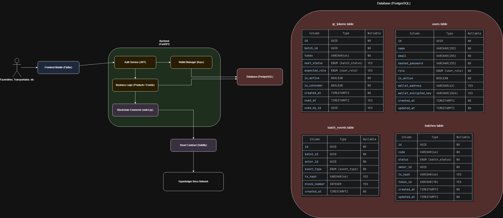
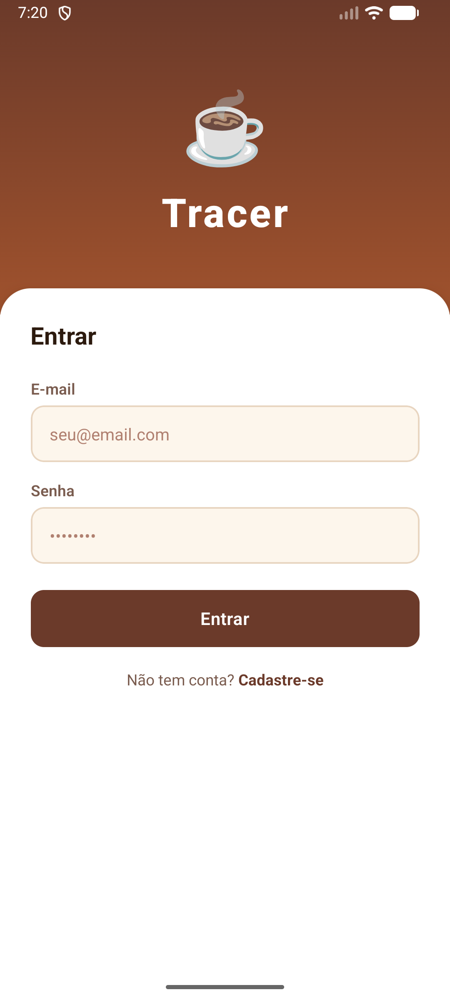
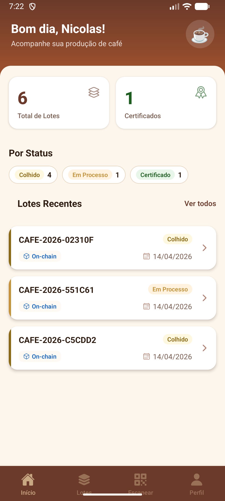
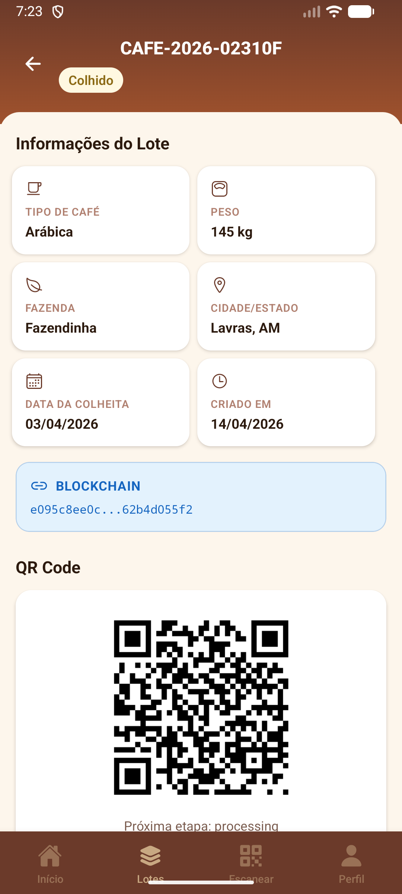

# Tracer

Rastreabilidade ponta a ponta para a cadeia de produção do café, apoiada
por uma blockchain privada **Hyperledger Besu**. Cada lote de café é
registrado on-chain no momento da colheita e, a partir daí, acumula uma
trilha de auditoria imutável de eventos (processamento, torra, transporte,
entrega, certificação) à medida que avança pela cadeia produtiva.
Produtores, processadores, transportadores, auditores e administradores
interagem com a mesma fonte de verdade, e qualquer consumidor pode
verificar o histórico de um lote escaneando um QR code.

A blockchain é tratada como o **sistema de registro** dos dados de lotes
e eventos. O banco de dados relacional guarda apenas metadados
operacionais — usuários, tokens de QR, índices e as referências
necessárias para consultas rápidas e controle de acesso.

## Estrutura do Projeto

```
.
├── contracts/              # CoffeeTrace.sol (smart contract Solidity)
├── besu/                   # Genesis + configuração do nó validador
├── scripts/                # Script de compilação e deploy do contrato
├── tracer-backend/         # Serviço FastAPI (API REST)
├── tracer-frontend/        # App mobile Expo / React Native
├── docker-compose.yml      # Orquestra Besu, deployer, db, api
└── .env.example            # Template de variáveis para o Compose
```

## Arquitetura



## Screenshots

| Login | Home | Lotes |
|-------|------|-------|
|  |  |  |

## Stack

### Backend (`tracer-backend/`)

- **Python 3.13** com [uv](https://docs.astral.sh/uv/) para gerenciamento de dependências
- **FastAPI** + **Uvicorn** na camada HTTP
- **SQLAlchemy 2.x (async)** + **asyncpg** como ORM, com migrações via **Alembic**
- **PostgreSQL 17** para metadados operacionais
- **Pydantic v2** / **pydantic-settings** para schemas e configuração
- **python-jose** (JWT) + **bcrypt** para autenticação
- **cryptography (Fernet)** para criptografia em repouso das chaves de carteira custodiais
- **web3.py 7.x** + **eth-account** para interação com a blockchain
- **segno** para geração de QR code
- **pytest** + **pytest-asyncio** + **httpx** para testes
- **Ruff** para lint/format

### Blockchain

- **Hyperledger Besu** rodando uma rede privada **QBFT** Proof-of-Authority
- **Solidity 0.8.20** (EVM Paris, para manter compatibilidade com o genesis Berlin do Besu — evita o opcode `PUSH0`)
- **py-solc-x** para compilar o contrato a partir do container deployer

### Frontend (`tracer-frontend/`)

- **Expo SDK 54** / **React Native 0.81** / **React 19**
- **expo-router** para navegação baseada em arquivos
- **expo-camera** para leitura de QR, **expo-secure-store** para armazenamento de tokens
- **TanStack Query** (React Query) para estado de servidor
- **Zustand** para estado de cliente
- **axios** como cliente HTTP
- **TypeScript**

### Infraestrutura

- **Docker Compose** — orquestra quatro serviços:
    - `besu-node1` — nó validador QBFT
    - `deployer` — job único que compila e faz deploy do smart contract
    - `db` — PostgreSQL
    - `api` — backend FastAPI (espera o deployer terminar)

## Como Executar

### Início rápido (Docker Compose)

```bash
# 1. Configure o ambiente
cp .env.example .env
# Edite o .env e preencha:
#   - POSTGRES_PASSWORD
#   - SECRET_KEY  (python -c "import secrets; print(secrets.token_hex(32))")
#   - WALLET_ENCRYPTION_KEY (python -c "from cryptography.fernet import Fernet; print(Fernet.generate_key().decode())")

# 2. Suba toda a stack (Besu + deployer + Postgres + API)
docker compose up --build
```

O que acontece na primeira inicialização:

1. `besu-node1` inicia a rede QBFT a partir de `besu/genesis.json` (chainId `1337`).
2. `deployer` aguarda o nó ficar saudável, compila
   `contracts/CoffeeTrace.sol` com `solc 0.8.20`, faz o deploy usando uma
   conta de desenvolvimento e grava o **endereço** + **ABI** resultantes
   em um volume `contract_data` compartilhado.
3. `db` inicia o PostgreSQL.
4. `api` aguarda o deployer terminar, copia o ABI para
   `app/abi/CoffeeTrace.json`, exporta `CONTRACT_ADDRESS` a partir do
   arquivo de endereço, executa `alembic upgrade head` e finalmente
   inicia o Uvicorn.

A API ficará disponível em `http://localhost:8000` (Swagger UI em `/docs`).
O RPC do Besu é exposto em `http://localhost:8545`.

Para forçar um novo deploy do contrato, remova o volume `contract_data`:

```bash
docker compose down -v
```

### Comandos úteis (a partir de `tracer-backend/`)

```bash
pytest                                        # rodar testes
pytest tests/path/to/test.py::test_name       # teste único
ruff check app/                               # lint
ruff format app/                              # format
alembic revision --autogenerate -m "mensagem" # nova migração
alembic upgrade head                          # aplicar migrações
```

### Frontend (Expo)

A partir de `tracer-frontend/`:

```bash
npm install
npm run start        # abre o Expo dev tools
npm run android      # ou roda no Android
npm run ios          # ou roda no iOS
```

## Comportamento da Blockchain

### Rede

Um nó **Hyperledger Besu** validador único rodando **QBFT**
(Proof-of-Authority). O genesis é configurado com chainId `1337`,
período de bloco de 2 segundos e gas price `0`. Discovery está
desabilitado — esta é uma rede privada, não uma testnet pública.

### Carteiras custodiais

Todo usuário recebe uma carteira Ethereum recém-gerada no momento do
cadastro (`AuthService.register_user` → `WalletService`). A chave
privada é **criptografada com Fernet usando `WALLET_ENCRYPTION_KEY`** e
armazenada na tabela `users`. Ela **nunca** é retornada por nenhum
endpoint da API; `GET /users/me/wallet` expõe somente o endereço.
Quando o usuário executa uma ação que precisa ser assinada, o backend
descriptografa a chave em memória, assina a transação e a descarta.

### Divisão da fonte de verdade

O smart contract armazena **todos** os dados de negócio de um lote e
seus eventos como strings JSON on-chain. O banco relacional mantém:

- `users` — login, papel (role), carteira criptografada
- `batches` — código, status, `owner_id`, `tx_hash`, `token_id`, timestamps
  (usado como índice rápido; o registro canônico vive on-chain)
- `qr_tokens` — tokens opacos que mapeiam um QR code público para um lote

Essa divisão permite que a API responda rapidamente a consultas de
listagem/filtragem a partir do Postgres e, ao mesmo tempo, recorra à
chain para ler os dados autoritativos de lotes e eventos via
`get_batch_from_chain` / `get_events_from_chain`.

### Ciclo de vida

Os lotes progridem pelos seguintes status:

```
HARVESTED → PROCESSING → ROASTING → IN_TRANSIT → DELIVERED → CERTIFIED
```

Quando um produtor cria um lote (`POST /batches/`), o backend chama
`registerBatch` on-chain com um payload JSON contendo todos os campos
do lote (tipo de café, peso, fazenda/cidade/estado de origem, data de
colheita, descrição). Quando qualquer papel atualiza o status ou
publica um novo evento (`PATCH /batches/{id}/status`,
`POST /batches/{id}/events`), o backend chama `addEvent` com o tipo do
evento e um payload JSON (localização, latitude/longitude, metadados
específicos da etapa, observações). A transação é assinada pela
carteira custodial do **usuário que está agindo**, então o `msg.sender`
on-chain reflete o ator real — não uma única chave global da plataforma.

### Formato da transação

As transações são montadas com `gasPrice = 0`, `gas = 3_000_000` e o
`chainId` configurado. São assinadas localmente com `eth-account` e
enviadas via `eth_sendRawTransaction`. O backend espera até 30s pelo
recibo e persiste `tx_hash` (e `blockNumber`, no caso de eventos) na
linha local. Se a chamada à chain falhar, a operação é registrada em
log e `None` é retornado — a escrita no banco é desacoplada da escrita
na chain, então a API permanece responsiva mesmo se a chain estiver
brevemente indisponível.

### RBAC

A dependência `require_roles(*roles)` em `app/core/deps.py` aplica
controle de acesso baseado em papéis em todas as rotas protegidas:

| Recurso                                  | Papéis permitidos                                |
|------------------------------------------|--------------------------------------------------|
| `POST /auth/register`, `POST /auth/login`| Público                                          |
| `GET /users/`                            | `ADMIN`                                          |
| `GET /users/me/wallet`                   | Qualquer usuário autenticado (retorna só endereço)|
| `POST /batches/`                         | `FARMER`, `ADMIN`                                |
| `PATCH /batches/{id}/status`             | `FARMER`, `PROCESSOR`, `TRANSPORTER`, `ADMIN`    |
| `POST /batches/{id}/events`              | `FARMER`, `PROCESSOR`, `TRANSPORTER`, `ADMIN`    |

Auditores têm acesso somente leitura à trilha.

## Smart Contract — `CoffeeTrace.sol`

Implantado automaticamente pelo serviço Compose `deployer`. O código
Solidity vive em `contracts/CoffeeTrace.sol`; o ABI é compartilhado com
o backend via volume Docker e gravado em
`tracer-backend/app/abi/CoffeeTrace.json`.

### Intenção do design

O contrato é intencionalmente minimalista. Ele não codifica a máquina de
estados de negócio, não mantém papéis e não valida transições de etapa
on-chain. Tudo isso pertence à camada da API (onde já temos usuários
autenticados, papéis e tratamento de erros mais rico). A única função
do contrato é fornecer um **livro-razão append-only e à prova de
adulteração** com dois tipos de registro: registros de lotes e eventos
de lotes.

Isso mantém o gas baixo, deixa o contrato pequeno o suficiente para não
precisar de um caminho de upgrade e permite que o backend evolua as
regras de negócio sem reimplantar.

### Estado

```solidity
struct Batch {
    string  batchCode;     // código legível (ex.: "BR-2026-0001")
    string  data;          // JSON: coffee_type, weight_kg, origin_*, harvest_date, description
    address owner;         // carteira que registrou o lote
    uint256 registeredAt;  // block.timestamp no momento do registro
    bool    exists;        // sentinela — distingue "ausente" de "zero por padrão"
}

struct BatchEvent {
    string  eventType;     // string livre ("processing", "roasting", "in_transit", ...)
    string  data;          // JSON: location, latitude, longitude, metadata, notes
    address actor;         // carteira que emitiu o evento
    uint256 timestamp;     // block.timestamp
    uint256 blockNumber;   // block.number — útil para ordenação no lado da chain
}

mapping(string => Batch)        public  batches;        // batchId → Batch (getter automático)
mapping(string => BatchEvent[]) private _batchEvents;   // batchId → lista ordenada de eventos
```

`batchId` é o UUID off-chain da linha local em `batches`, que é o que
amarra o índice do banco de dados ao registro on-chain. `batchCode` é o
rótulo voltado ao operador (impresso nos QR codes).

### API de Escrita

#### `registerBatch(string batchId, string batchCode, string data)`

- Reverte se `batches[batchId].exists` (ou seja, duplicatas são rejeitadas).
- Armazena o novo `Batch` com `owner = msg.sender`,
  `registeredAt = block.timestamp`, `exists = true`.
- Emite `BatchRegistered(batchId, batchCode, owner, timestamp)`.
- Chamado pela API quando um produtor cria um lote. A carteira
  custodial usada na assinatura é a do produtor, então `owner` é o
  endereço do produtor.

#### `addEvent(string batchId, string eventType, string data)`

- Reverte se o lote ainda não existir (sem eventos órfãos).
- Anexa um `BatchEvent` com `actor = msg.sender`,
  `timestamp = block.timestamp`, `blockNumber = block.number`.
- Emite `EventAdded(batchId, eventType, actor, timestamp)`.
- Chamado pela API a cada mudança de status e a cada evento explícito,
  assinado pela carteira do usuário que tomou a ação (processador,
  transportador, auditor, etc.).

Note que `addEvent` **não** verifica o papel de quem chama nem se o
novo evento faz sentido após o anterior. A validação de status
(`HARVESTED → PROCESSING`, etc.) acontece na API; este contrato apenas
registra o que aconteceu.

### API de Leitura

#### `batches(string batchId) → (batchCode, data, owner, registeredAt, exists)`

Getter público gerado automaticamente para o mapping `batches`. O
`get_batch_from_chain` do backend decodifica a tupla retornada,
interpreta `data` como JSON e retorna `None` se `exists` for falso.

#### `getBatchEventCount(string batchId) → uint256`

Retorna o número de eventos registrados para um lote. O backend combina
isso com `getBatchEvent` em um laço para materializar a lista completa
de eventos.

#### `getBatchEvent(string batchId, uint256 index) → (eventType, data, actor, timestamp, blockNumber)`

Retorna um único evento pelo seu índice. Reverte com o erro padrão de
acesso fora dos limites do array se `index >= _batchEvents[batchId].length`.

### Eventos

Dois eventos são emitidos para indexação off-chain:

```solidity
event BatchRegistered(
    string indexed batchId,
    string batchCode,
    address indexed owner,
    uint256 timestamp
);

event EventAdded(
    string indexed batchId,
    string eventType,
    address indexed actor,
    uint256 timestamp
);
```

`batchId` e o endereço do principal são indexados para que assinantes
possam filtrar de forma eficiente. O backend, atualmente, não escuta
logs — ele depende do recibo síncrono da transação — mas os eventos
permitem que um indexador externo ou serviço de auditoria espelhe o
estado da chain sem fazer polling.

### Propriedades importantes

- **Append-only.** Não há `update` nem `delete`. Um evento incorreto só
  pode ser corrigido anexando um evento corretivo.
- **Escrita sem permissão (intencional).** Qualquer carteira pode
  chamar `registerBatch` / `addEvent`. A autorização é feita na API; o
  contrato confia que quem detém uma chave foi validado off-chain.
- **Sem transferências de token nativo.** Todas as transações rodam
  com `gasPrice = 0` na chain QBFT privada, então os usuários não
  precisam ser fundeados.
- **Payloads JSON.** Armazenar JSON como `string` é barato em gas em
  uma chain privada com gas price zero e permite que o schema evolua
  sem redeploy. Em uma chain pública isso seria uma má escolha; aqui é
  o trade-off correto.
- **Solc 0.8.20 + `evm-version: paris`.** O genesis do Besu só habilita
  o hard fork **Berlin**, então o contrato é compilado mirando Paris
  para evitar emitir o opcode `PUSH0` (introduzido em Shanghai), que a
  chain rejeitaria.
